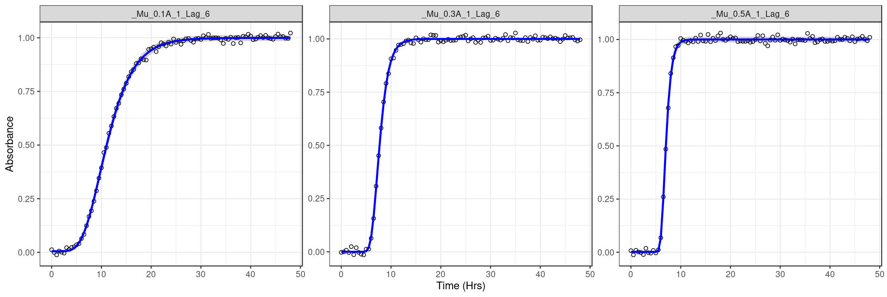
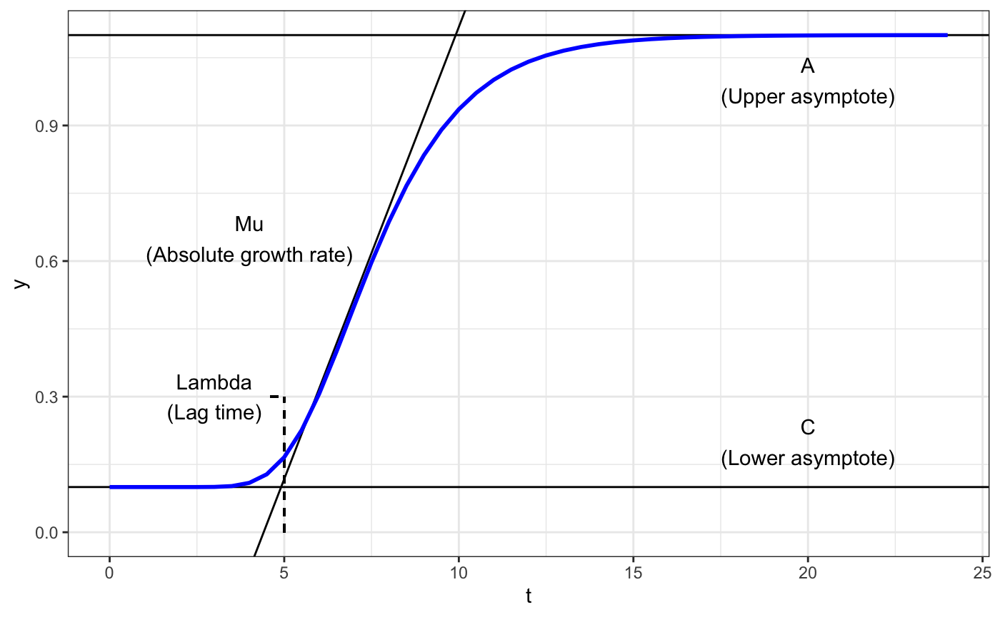

[Scott H. Saunders](saunderslab.org), Distinguished Fellow UTSW

[Growth curve fittR homepage](https://saunders-lab.github.io/growth_curve_fittr/)

---

## Accessing the app

The code for the growth curve fitting app lives in this github repository. There are three options to run the app:

1. **[Growth Curve FittR on shinyapps.io](https://saunders-lab.shinyapps.io/growth_curve_fittR/)**

*This is the easiest browser option. The app will load quickly, but due to limits on the number of users it may not always be accessible.*

2. **[Growth Curve FittR on MyBinder](https://mybinder.org/v2/gh/saunders-lab/growth_curve_fittr/main?urlpath=shiny/growth_curve_fittR_app.Rmd)**

*This provides a backup browser option that is equivalent to the first, but will load more slowly.*

3. **Download this repo and run Growth Curve FittR on your own computer**

*Once you have R/Rstudio your own computer, you can install the required libraries and run `growth_curve_fittR_app.Rmd` locally.*

---

## Motivation

One of the most common experiments in microbiology is the growth curve. Typically, absorbance measurements (wavelength = 600 nm) are taken over time, which correspond to cell density in the liquid medium. As cells divide to reproduce, their overall growth reflects an exponential process, until they run out of food and stop growing. These growth curves are often used as qualitative data to show that cells grew more slowly or to a lower density in one condition compared to another. However, there are many ways that growth curves can be understood quantitatively. Microbiologists have long appreciated this fact, and generations of trainees have calculated parameters by finding the slope of a growth curve on a log scale. This project aims to modernize this tradition, by empowering users to rapidly quantify parameters and uncertainty from their data without having to code.

---

## Further reading

* [Understanding Gompertz Curves](https://saunders-lab.github.io/growth_curve_fittr/docs/generate_gomp_curves.html)
* [Gompertz Curves vs. Splines](https://saunders-lab.github.io/growth_curve_fittr/docs/gomp_spline_param_comparison.html)

