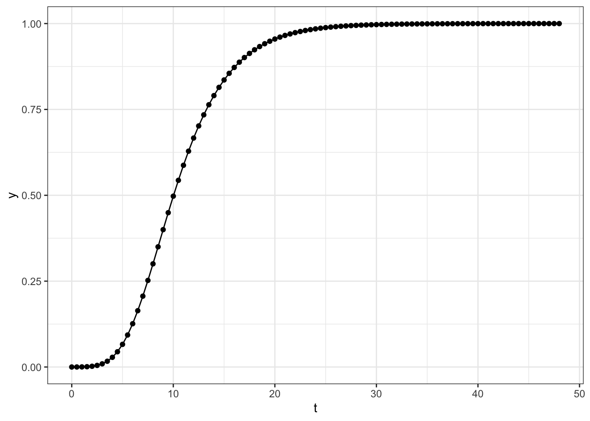
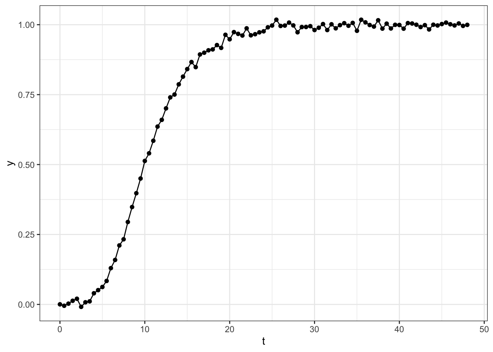
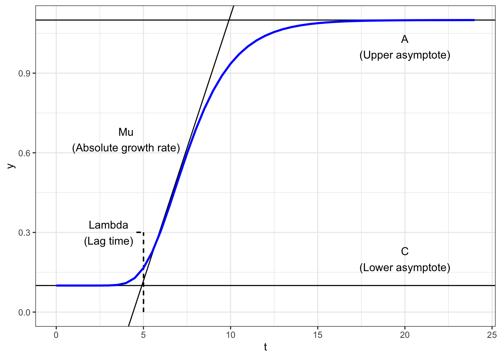
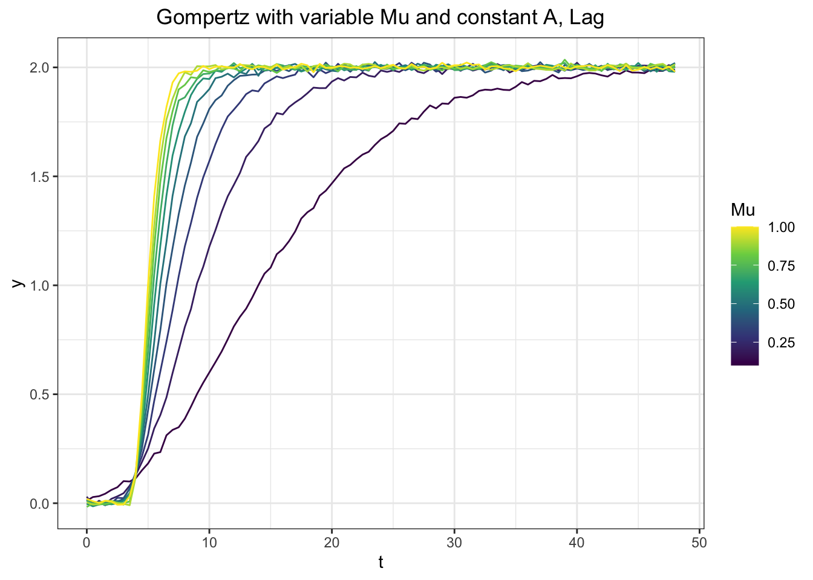
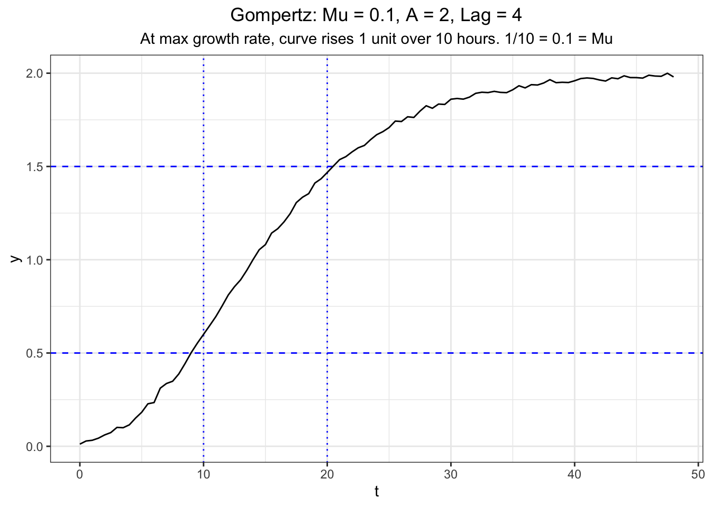
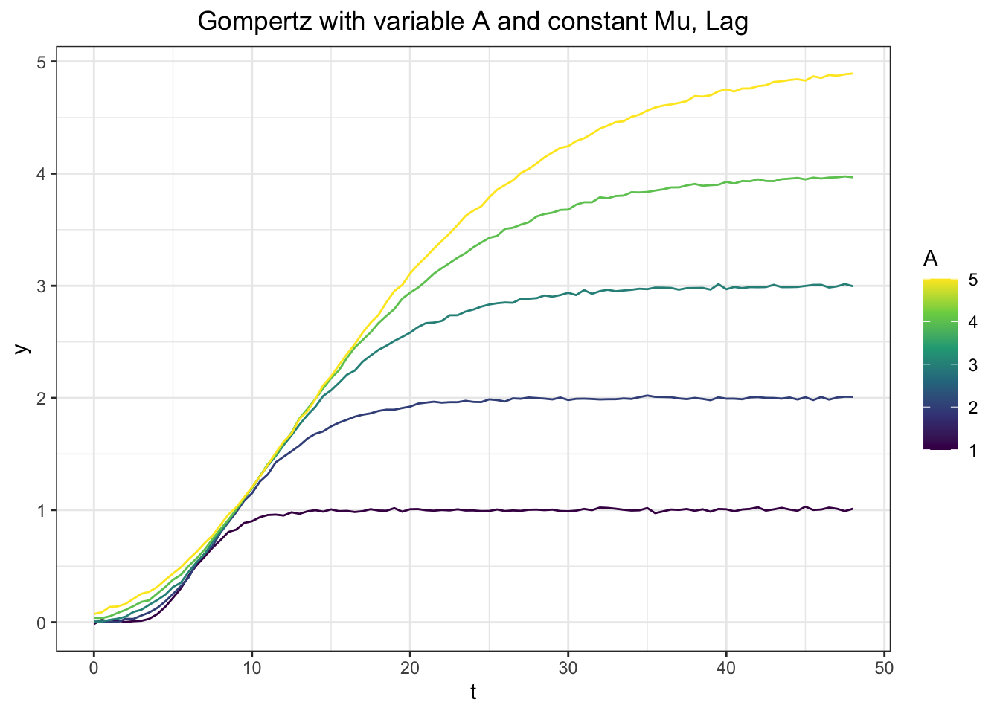
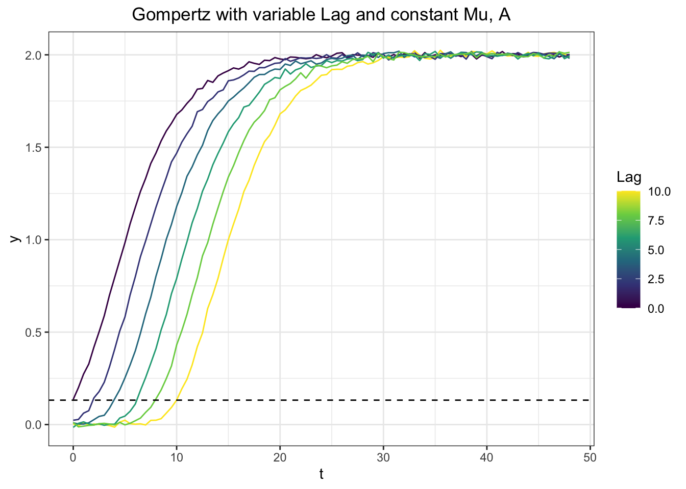
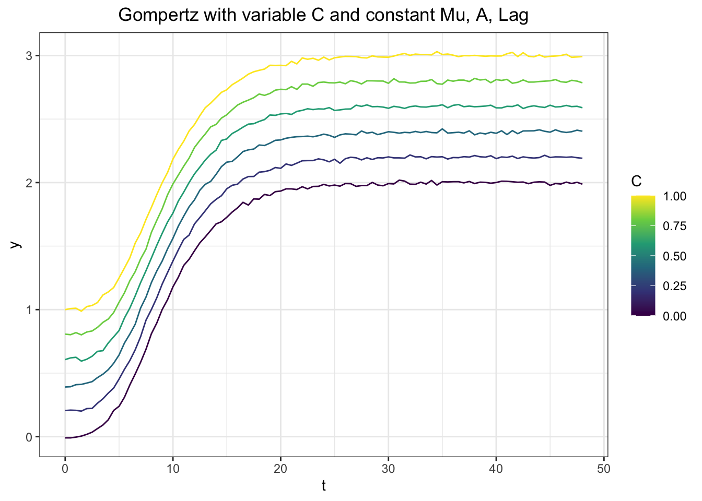
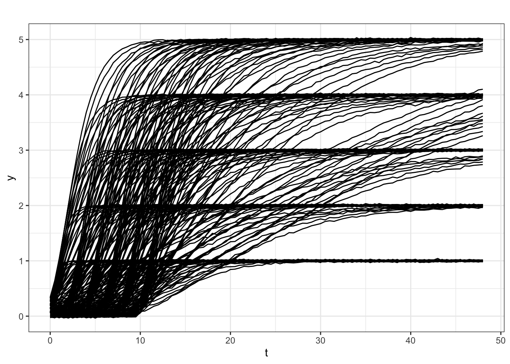
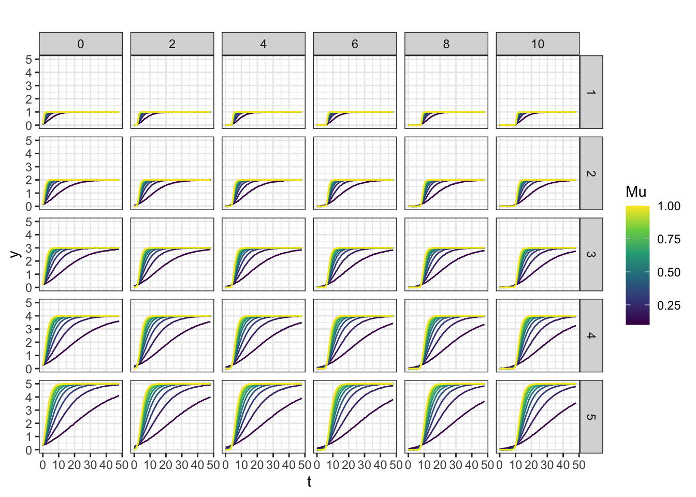

------

# Defining a Gompertz curve

The Gompertz curve is a sigmoid function that can be parameterized such that it describes population growth with easily interpretable parameters. Based on [Zwietering 1990](https://aem.asm.org/content/56/6/1875), and [Tjorve, 2017](https://journals.plos.org/plosone/article?id=10.1371/journal.pone.0178691) this work uses a Gompertz function with four parameters: 

* $\mu_A$ - absolute growth rate
* $A$ - upper asymptote (i.e. max population size)
* $\lambda$ - lag time
* $C$ - lower asymptote (i.e. constant background)


These parameters will be discussed and explored in more detail below. This is the form of the Gompertz function used here:

$$ y = A exp \left(-exp \left(\frac{\mu_A e}{A}(\lambda - t) + 1 \right)\right) + C \tag{1}$$

To gain an intuition for the Gompertz curve let's define a function to generate these curves with parameter values we specify:


```r
#' This function generate gompertz curves from the form of eq 1
#' It takes 6 inputs starting with the 4 gompertz parameters:
#' A (upper asymptote), Mu (absolute growth rate), Lag (lag time), and C (lower asymptote)
#' It uses these parameters to generate datasets with normal noise of standard deviation, sd
#' for a time series, t.
#' Default time series is 0 to 48 by 0.5 units.
#' Default noise is 0.01 units.
#' Returns a tibble with two columns - the time series, t, and the calculated gompertz vals, y.

gen_gompertz <- function( Mu, A, Lag, C = 0, sd = 0.01, t = seq(0,48,0.5)){
  
  # Calculate a perfect gompertz curve for the supplied inputs
  vals = A*exp(-exp(((Mu*exp(1))/A)*(Lag - t) + 1)) + C
  
  # Add noise with rnorm
  tibble(t = t, y = rnorm(vals, mean = vals, sd = sd))
}
```

Let's see how this function works. Note this function has no inherent units, but the output units are simply determined by the input units. For simplicity, let's assume that the units of time are hours and the output is OD500 (a common proxy for bacterial cell density). That gives the following units:

* $\mu_A = \frac{OD_{500}}{hr}$ 
* $A =OD_{500}$
* $\lambda = hrs$
* $C = OD_{500}$. 

First, let's supply some reasonable parameter values `Mu = 0.1, A = 1, Lag = 1, C = 0`. Calling the function with these parameters, and no noise (`sd = 0`) for time zero hours and time 100 hours (`t = c(0,100)`) yields the bounds of the curve.


```r
gen_gompertz(Mu = 0.1, A = 1, Lag = 5, C = 0, sd = 0, t = c(0,100))
```

```
## # A tibble: 2 x 2
##       t         y
##   <dbl>     <dbl>
## 1     0 0.0000254
## 2   100 1.00
```

At time zero, `y` is near zero and at time 100, `y` is at the upper asymptote of 1. Now let's generate a full dataset over the course of two days (48 hours), which is the default timeseries.


```r
df <- gen_gompertz(Mu = 0.1, A = 1, Lag = 5, C = 0, sd = 0)

df
```

```
## # A tibble: 97 x 2
##        t         y
##    <dbl>     <dbl>
##  1   0   0.0000254
##  2   0.5 0.0000974
##  3   1   0.000315 
##  4   1.5 0.000877 
##  5   2   0.00215  
##  6   2.5 0.00469  
##  7   3   0.00926  
##  8   3.5 0.0168   
##  9   4   0.0282   
## 10   4.5 0.0444   
## # … with 87 more rows
```

You can see that this generates a time series data frame where `y` steadily increases. Plotting this dataset, we can see it creates a sigmoid form that we would expect for a simple growth curve. 


```r
ggplot(df, aes(x = t, y = y)) + geom_path() + geom_point()
```



We can make this curve a bit more realistic by adding noise from a normal distribution. Remaking this curve with the default noise of `sd = 0.01` gives us this curve.


```r
gen_gompertz(Mu = 0.1, A = 1, Lag = 5, C = 0) %>% 
  ggplot(., aes(x = t, y = y)) + geom_path() + geom_point()
```



Great! Now we have a simple function that can generate somewhat realistic growth curves from the Gompertz function when we supply it with parameter values.

-------

# Gaining parameter intuition


```r
labels = tibble(text = c('Mu\n(Absolute growth rate)','A\n(Upper asymptote)','C\n(Lower asymptote)','Lambda\n(Lag time)'),
                x = c(4,20,20,3),
                y = c(0.65,1,0.2,0.3))

ggplot(gen_gompertz(0.2,1,5,0.1,0, t = seq(0,24,0.5)), aes(x = t, y = y)) + 
  geom_hline(yintercept = 1.1) +
  geom_hline(yintercept = 0.1) +
  geom_segment(y = 0.3, x= 4.6, yend = 0.3, xend = 5, linetype = 'dashed')+
  geom_segment(y = 0, x= 5, yend = 0.3, xend = 5, linetype = 'dashed')+
  geom_abline(slope = 0.2, intercept = -0.8821)+
  geom_path(color = 'blue', size = 1) + 
  geom_text(data = labels, aes(x = x, y = y, label = text))+
  ylim(0,NA)
```



With our new curve generating capabilities, let's simulate some datasets with different parameter values to gain an intuition for how parameters control these Gompertz curves.

## $\mu_A$ - Absolute growth rate


```r
df_mu <- expand_grid(Mu = seq(0.1, 1, 0.1 ), A = 2, Lag = 4)

df_mu_data <- df_mu %>% 
  mutate(gomp = pmap(list(Mu, A, Lag),gen_gompertz)) %>% 
  mutate(params = paste0('Mu_',Mu,'_A_',A,'_Lag_',Lag))

df_mu_data
```

```
## # A tibble: 10 x 5
##       Mu     A   Lag gomp              params          
##    <dbl> <dbl> <dbl> <list>            <chr>           
##  1   0.1     2     4 <tbl_df [97 × 2]> Mu_0.1_A_2_Lag_4
##  2   0.2     2     4 <tbl_df [97 × 2]> Mu_0.2_A_2_Lag_4
##  3   0.3     2     4 <tbl_df [97 × 2]> Mu_0.3_A_2_Lag_4
##  4   0.4     2     4 <tbl_df [97 × 2]> Mu_0.4_A_2_Lag_4
##  5   0.5     2     4 <tbl_df [97 × 2]> Mu_0.5_A_2_Lag_4
##  6   0.6     2     4 <tbl_df [97 × 2]> Mu_0.6_A_2_Lag_4
##  7   0.7     2     4 <tbl_df [97 × 2]> Mu_0.7_A_2_Lag_4
##  8   0.8     2     4 <tbl_df [97 × 2]> Mu_0.8_A_2_Lag_4
##  9   0.9     2     4 <tbl_df [97 × 2]> Mu_0.9_A_2_Lag_4
## 10   1       2     4 <tbl_df [97 × 2]> Mu_1_A_2_Lag_4
```


```r
df_mu_data %>% 
  unnest(gomp) %>% 
  ggplot(., aes(x = t, y = y, group = params, color = Mu)) + 
  geom_path() + 
  scale_color_viridis_c()+
  labs(title = 'Gompertz with variable Mu and constant A, Lag')
```




```r
df_mu_data %>% 
  unnest(gomp) %>% 
  filter(Mu==0.1) %>% 
  ggplot(., aes(x = t, y = y, group = params)) + 
  geom_hline(yintercept = c(0.5,1.5),linetype = 'dashed', color = 'blue')+
  geom_vline(xintercept = c(10,20),linetype = 'dotted', color = 'blue')+
  geom_path() + 
  labs(title = 'Gompertz: Mu = 0.1, A = 2, Lag = 4', subtitle = 'At max growth rate, curve rises 1 unit over 10 hours. 1/10 = 0.1 = Mu')
```



### Converting to relative growth rate ($\mu_R$) or doubling time ($T_D$)

It is important to note that $\mu_A$ refers to absolute growth rate, *not* relative growth rate. This is valuable because it allows us to compare between spline and gompertz models and it makes intuitive sense that the same growth rate can continue for various time periods giving different final densities, $A$.

However, typically when we think about microbial growth curves we are interested in relative growth rates that can be converted into doubling times or generation times. Growth Curve FittR will do this automatically for you by relating absolute growth rate $\mu_A$ to a relative growth rate $\mu_R$. This conversion is simply:

$$ \mu_R =  \frac{\mu_A e}{A}$$

From relative growth rate, $\mu_R$. Doubling time, $t_d$ can be easily calculated:

$$ t_d = \frac{\ln(2)}{\mu_R}$$

## $A$ - Upper asymptote


```r
df_A <- expand_grid(Mu = 0.2, A = seq(1, 5, 1), Lag = 4)

df_A_data <- df_A %>% 
  mutate(gomp = pmap(list(Mu, A, Lag),gen_gompertz)) %>% 
  mutate(params = paste0('Mu_',Mu,'_A_',A,'_Lag_',Lag)) %>% 
  unnest(gomp)

ggplot(df_A_data, aes(x = t, y = y, group = params, color = A)) + 
  geom_path() + 
  scale_color_viridis_c()+
  labs(title = 'Gompertz with variable A and constant Mu, Lag')
```




## $\lambda$ - Lag time


```r
df_lag <- expand_grid(Mu = 0.2, A = 2, Lag = seq(0,10,2))

df_lag_data <- df_lag %>% 
  mutate(gomp = pmap(list(Mu, A, Lag),gen_gompertz)) %>% 
  mutate(params = paste0('Mu_',Mu,'_A_',A,'_Lag_',Lag)) %>% 
  unnest(gomp)

ggplot(df_lag_data, aes(x = t, y = y, group = params, color = Lag)) + 
  geom_path() + 
  geom_hline(yintercept = 0.132, linetype = 'dashed' )+
  scale_color_viridis_c()+
  labs(title = 'Gompertz with variable Lag and constant Mu, A')
```




## $C$ - Lower asymptote


```r
df_c <- expand_grid(Mu = 0.2, A = 2, Lag = 4, C = seq(0, 1, 0.2))

df_c_data <- df_c%>% 
  mutate(gomp = pmap(list(Mu, A, Lag, C),gen_gompertz)) %>% 
  mutate(params = paste0('Mu_',Mu,'_A_',A,'_Lag_',Lag, '_C_',C))%>% 
  unnest(gomp)


ggplot(df_c_data, aes(x = t, y = y, group = params, color = C)) + 
  geom_path() + 
  scale_color_viridis_c()+
  labs(title = 'Gompertz with variable C and constant Mu, A, Lag')
```




# Gompertz curves for benchmarking


LOW, MEDIUM, AND HIGH NOISE LEVELS sd = c(0.01, 0.05, 0.1). ignore C for now.


```r
df_gen <- expand_grid(Mu = seq(0.1, 1, 0.1 ), A = seq(1, 5, 1), Lag = seq(0,10,2)) #%>% 

df_gen_data <- df_gen %>% mutate(gomp = pmap(list(Mu, A, Lag),gen_gompertz))%>% mutate(params = paste0('_Mu_',Mu,'A_',A,'_Lag_',Lag))

df_gen_data %>% 
  unnest(gomp) %>% 
  ggplot(., aes(x = t, y = y, group = params)) + 
  geom_path() + 
  labs(title = '')
```



```r
df_gen_data %>% 
  unnest(gomp) %>% 
  ggplot(., aes(x = t, y = y, group = params, color = Mu)) + 
  geom_path() + facet_grid(c('A','Lag'))+
  scale_color_viridis_c()+
  labs(title = '')
```



```r
#df_gen_data_export <- df_gen_data %>% unnest(gomp) %>% pivot_wider(names_from = params, values_from = y, id_cols = t) %>% rename(time = t)

#write_csv(df_gen_data_export, 'gomp_params_sim_dataset.csv')
```


-------


```r
sessionInfo()
```

```
## R version 3.5.2 (2018-12-20)
## Platform: x86_64-apple-darwin15.6.0 (64-bit)
## Running under: macOS  10.16
## 
## Matrix products: default
## BLAS: /Library/Frameworks/R.framework/Versions/3.5/Resources/lib/libRblas.0.dylib
## LAPACK: /Library/Frameworks/R.framework/Versions/3.5/Resources/lib/libRlapack.dylib
## 
## locale:
## [1] en_US.UTF-8/en_US.UTF-8/en_US.UTF-8/C/en_US.UTF-8/en_US.UTF-8
## 
## attached base packages:
## [1] stats     graphics  grDevices utils     datasets  methods   base     
## 
## other attached packages:
## [1] forcats_0.4.0   stringr_1.4.0   dplyr_1.0.7     purrr_0.3.3    
## [5] readr_1.3.1     tidyr_1.0.0     tibble_2.1.3    ggplot2_3.3.5  
## [9] tidyverse_1.3.0
## 
## loaded via a namespace (and not attached):
##  [1] tidyselect_1.1.1  xfun_0.7          haven_2.2.0      
##  [4] lattice_0.20-38   colorspace_1.4-0  vctrs_0.3.8      
##  [7] generics_0.0.2    viridisLite_0.3.0 htmltools_0.4.0  
## [10] yaml_2.2.0        utf8_1.1.4        rlang_0.4.11     
## [13] pillar_1.6.2      withr_2.1.2       glue_1.4.2       
## [16] DBI_1.1.0         dbplyr_1.4.2      modelr_0.1.8     
## [19] readxl_1.3.1      lifecycle_1.0.0   munsell_0.5.0    
## [22] gtable_0.2.0      cellranger_1.1.0  rvest_0.3.5      
## [25] evaluate_0.14     labeling_0.3      knitr_1.23       
## [28] fansi_0.4.1       broom_0.5.4       Rcpp_1.0.5       
## [31] backports_1.1.3   scales_1.1.1      jsonlite_1.7.1   
## [34] farver_2.1.0      fs_1.3.1          hms_0.5.3        
## [37] digest_0.6.25     stringi_1.2.4     grid_3.5.2       
## [40] cli_2.0.2         tools_3.5.2       magrittr_1.5     
## [43] crayon_1.3.4      pkgconfig_2.0.3   ellipsis_0.3.2   
## [46] xml2_1.2.2        reprex_0.3.0      lubridate_1.7.4  
## [49] assertthat_0.2.1  rmarkdown_1.13    httr_1.4.1       
## [52] rstudioapi_0.10   R6_2.4.1          nlme_3.1-140     
## [55] compiler_3.5.2
```
