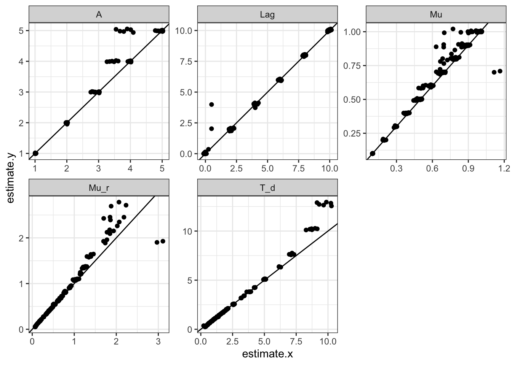
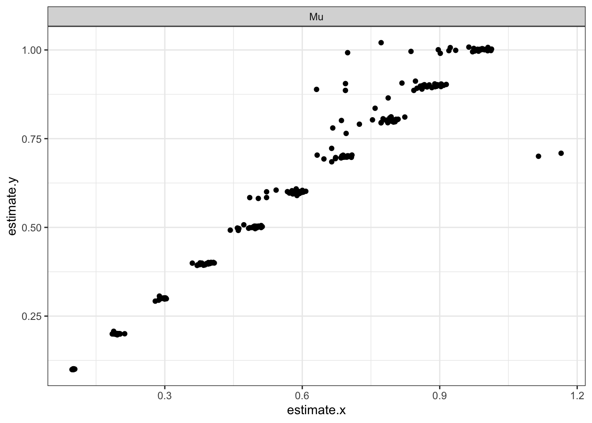
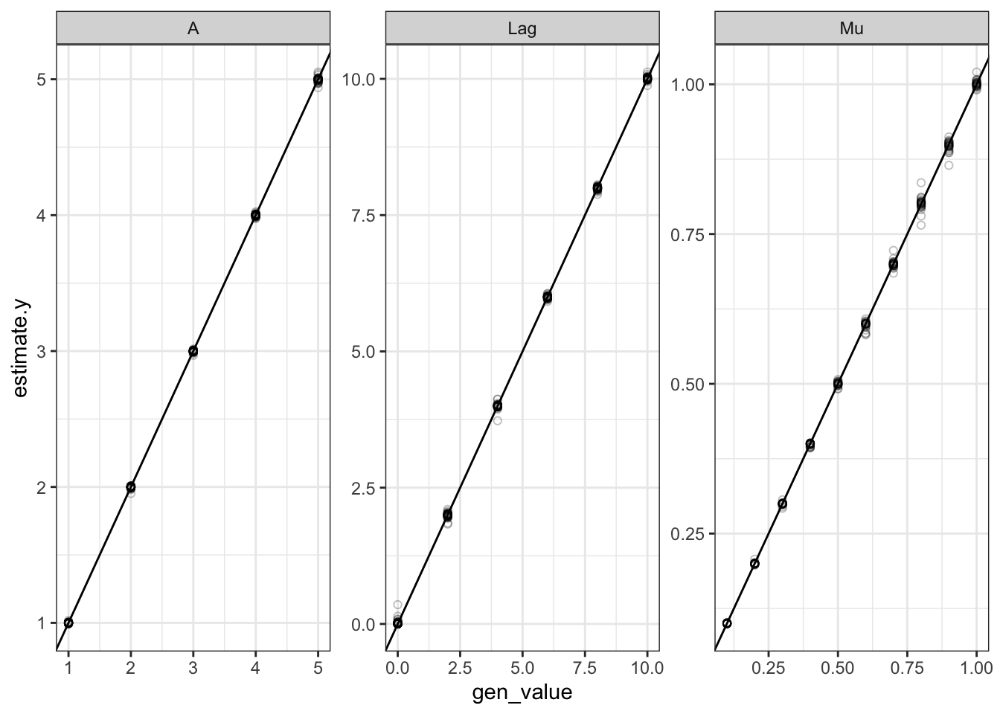
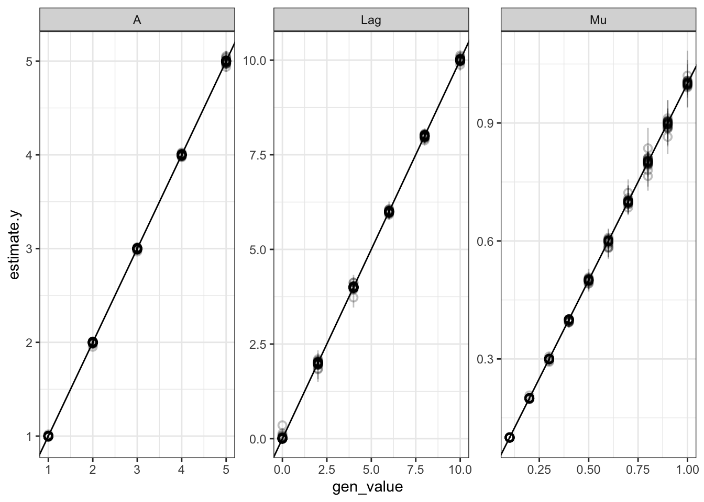
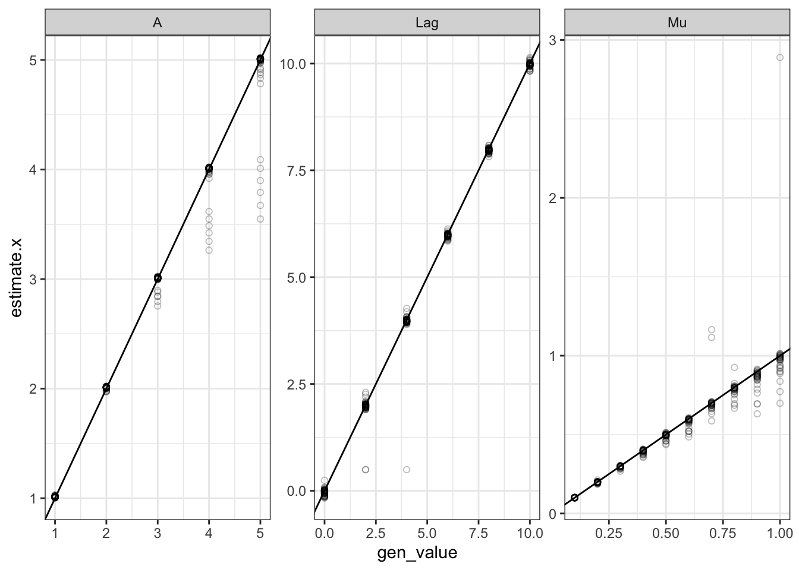
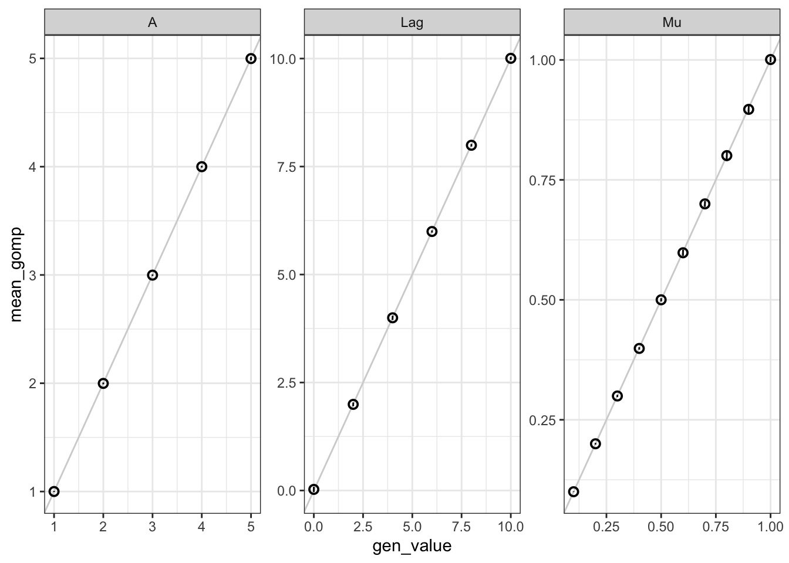
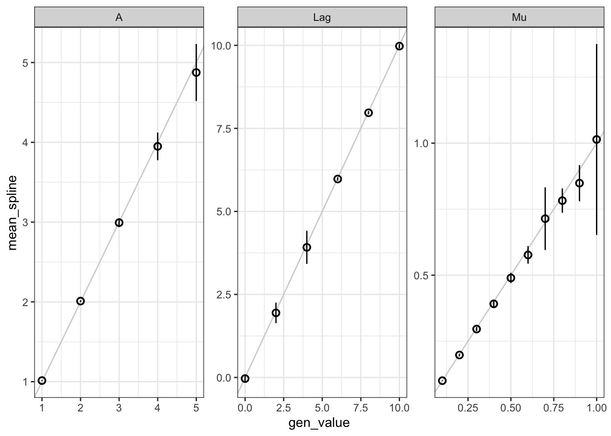

------


```r
df_gomp <- read_csv("./2021_12_03_gomp_growth_curve_parameter_estimates.csv")
df_spline <- read_csv("./2021_12_03_spline_growth_curve_parameter_estimates.csv")
```


```r
df_both <- left_join(df_spline, df_gomp, by = c('well', 'term'))
df_both
```

```
## # A tibble: 1,500 x 12
##    well  term  estimate.x fit_error_occur… estimate.y std.error statistic
##    <chr> <chr>      <dbl> <lgl>                 <dbl>     <dbl>     <dbl>
##  1 A_1_… Lag      -0.0848 FALSE                0       0.195          0  
##  2 A_1_… Mu        0.0974 FALSE                0.0994  0.00116       85.7
##  3 A_1_… A         1.01   FALSE                1.00    0.0174        57.5
##  4 A_1_… Lag       2.03   FALSE                2.07    0.0977        21.2
##  5 A_1_… Mu        0.0998 FALSE                0.0995  0.000971     102. 
##  6 A_1_… A         1.00   FALSE                0.992   0.00679      146. 
##  7 A_1_… Lag       3.98   FALSE                4.12    0.0739        55.8
##  8 A_1_… Mu        0.0996 FALSE                0.101   0.00100      101. 
##  9 A_1_… A         1.01   FALSE                0.993   0.00442      225. 
## 10 A_1_… Lag       6.03   FALSE                5.95    0.0609        97.7
## # … with 1,490 more rows, and 5 more variables: p.value <dbl>,
## #   conf.low <dbl>, conf.high <dbl>, est_error_occured <lgl>,
## #   mu_type <chr>
```


```r
ggplot(df_both %>% filter(!is.na(estimate.y)), aes(estimate.x, estimate.y)) + geom_point() + geom_abline(slope = 1, intercept = 0) + facet_wrap(~term, scales = 'free')
```




```r
ggplot(df_both %>% filter(term=='Mu') %>% filter(!is.na(estimate.y)), aes(estimate.x, estimate.y)) + geom_point() + facet_wrap(~term, scales = 'free')
```




```r
df <- df_both %>% separate(well, into = c('A','gen_A','Mu','gen_Mu','Lag','gen_Lag'), sep = "_")

wells <- df_both %>% select(well) %>% unique() 

well_vals <- wells %>%  separate(well, into = c('1','A','2','Mu','3','Lag'), sep = "_", convert = T) %>% select(A,Mu,Lag) 

well_meta <- bind_cols(wells, well_vals) %>% pivot_longer(c('A','Mu','Lag',),names_to = 'term', values_to = 'gen_value')

df_both_meta <- left_join(well_meta,df_both, by = c('well','term'))
```


```r
ggplot(df_both_meta, aes(x = gen_value, y = estimate.y )) + geom_point(shape = 21, alpha = 0.25) + geom_abline(slope = 1, intercept =0) + facet_wrap(~term,scales = 'free')
```



```r
ggplot(df_both_meta, aes(x = gen_value, y = estimate.y )) + geom_pointrange(aes(ymin =conf.low, ymax = conf.high), shape = 21, alpha = 0.25) + geom_abline(slope = 1, intercept =0) + facet_wrap(~term,scales = 'free')
```



```r
ggplot(df_both_meta, aes(x = gen_value, y = estimate.x )) + geom_point(shape = 21, alpha = 0.25) + geom_abline(slope = 1, intercept =0) + facet_wrap(~term,scales = 'free')
```




```r
df_both_meta %>% 
  group_by(term, gen_value) %>% 
  summarise(mean_gomp = mean(estimate.y, na.rm = T), mean_spline = mean(estimate.x, na.rm = T), sd_gomp = sd(estimate.y, na.rm = T), sd_spline = sd(estimate.x, na.rm = T)) %>%
  ggplot(.,aes(x = gen_value, y = mean_gomp)) + 
  geom_abline(slope = 1, intercept = 0, color = 'light gray')+
  geom_pointrange(aes(ymin = mean_gomp - sd_gomp, ymax = mean_gomp + sd_gomp), shape = 21)+
  facet_wrap(~term, scales = 'free')+ theme_bw()
```



```r
df_both_meta %>% 
  group_by(term, gen_value) %>% 
  summarise(mean_gomp = mean(estimate.y, na.rm = T), mean_spline = mean(estimate.x, na.rm = T), sd_gomp = sd(estimate.y, na.rm = T), sd_spline = sd(estimate.x, na.rm = T)) %>%
  ggplot(.,aes(x = gen_value, y = mean_spline)) + 
  geom_abline(slope = 1, intercept = 0, color = 'light gray')+
  geom_pointrange(aes(ymin = mean_spline - sd_spline, ymax = mean_spline + sd_spline), shape = 21)+
  facet_wrap(~term, scales = 'free') + theme_bw()
```



Try generating triplicate curves and averaging with spline to see how well performs with confidence interval on parameters. More realistic with experimental replicates.
